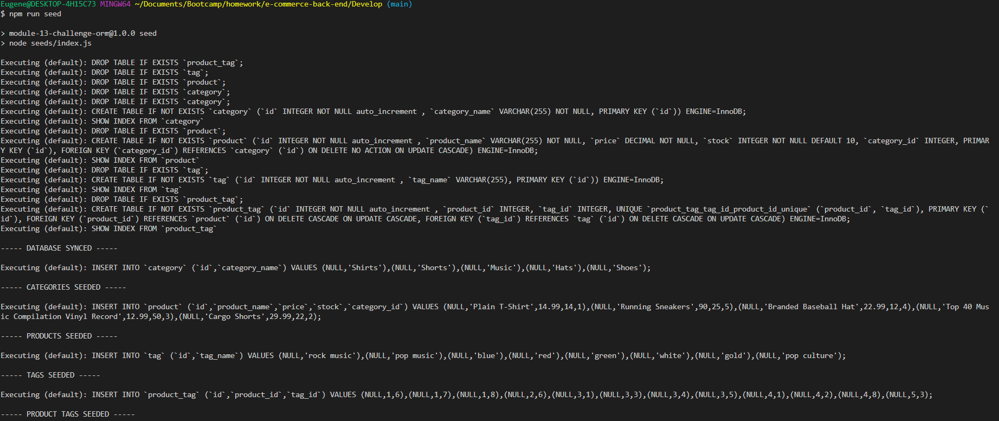
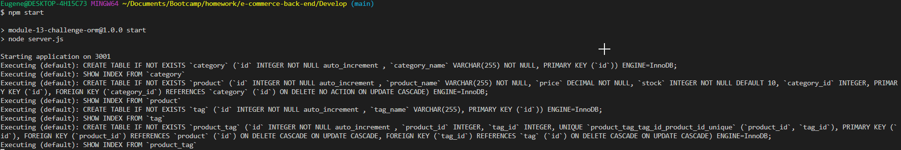

# E-Commerce-Back-End

## Table of Contents

- [Description](#description)
- [Installation](#installation)
- [Media](#media)
- [GitHub Repository](#github-repository)
- [Contributors](#contributors)

## Description

My E-Commerce-Back-End program manages a comapies database. The program allows a user to get information, post information, put (update) information, and delete information from the database.

## Installation

- Clone the repository to your local machine
- Install local dependencies
    * Install npm: "npm install" 
- If manual installation is needed:
    * express: "npm install express"
    * dotenv: "npm install dotenv"
    * sequelize: "npm install sequelize"
    * MySql2: "npm install mysql2"
- Open SQL workbench and type in "CREATE DATABASE ecommerce_db"
- Right click on 'package.json' and select open integrated terminal
- Enter "npm run seed" to seed the database
- Enter "npm start" to start up the server

## Media

[Video link to insomia usage](https://drive.google.com/file/d/1J_Iug4kKk_bpViPmqq9v7RHnmj9TddAB/view?usp=sharing)

## GitHub Repository

[Repository link for my ecommerce back end assignment](https://github.com/eugene125/e-commerce-back-end)

## Contributors

- Kelly Jefferies
- Daniel Norred

## Technologies Used:
- Javascript
- Node
- Express
- MySQL2
- Dotenv
- Sequelize

## License:

